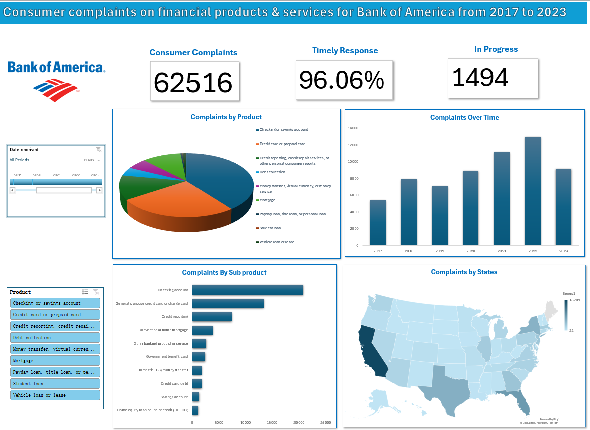
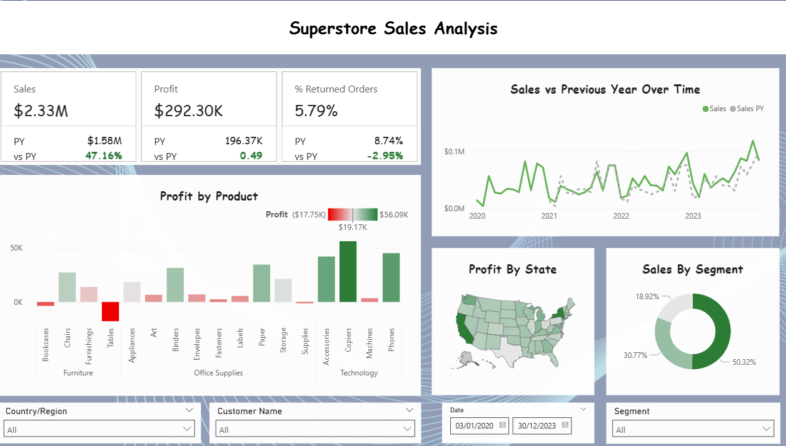

# Project 1

**Title:** [BMW Global Sales Performance (2010–2024)](https://github.com/zahenrile01/zahenrile01.github.io/blob/main/Bmw%20Sales4.xlsx)

**Tools Used:** Microsoft Excel(Pivot Table, Pivot Chart, Slicers, KPI Cards, Timeline, Shapes&Formating, Conditional Formating)

**Project Description:** This project involved analysing BMW global sales data from 2010 to 2024 to identify trends in sales volume, pricing and performance across models, regions and fuel types. It is designed to provide a clear and interactive overview of key performance metrics. This dashboard allows stakeholders to easily monitor and assess BMW’s market performance across different years, regions, and product segments.

The dashboard includes the following features:

*Yearly Sales Volume Trend*: A visual line chart showing how BMW’s worldwide sales volume has changed from 2010 to 2024. This helps identify overall growth patterns, seasonal fluctuations and long term trends.

*Average Price per Model*: Highlights the average selling price of major BMW models. This provides insight into pricing differences across the product lineup.

*Sales Volume by Region*: Visual representation of total sales distributed across six continents, highlighting regional market share and performance.

*Sales Volume by Fuel Type*: Yearly comparison of Hybrid, Petrol, Electric, and Diesel vehicle sales, tracking the evolution of consumer preferences.

*Sales Classification by Region*: Percentage distribution of Low vs. High sales categories across geographic markets, assessing sales quality by region.

*Sales Volume by Fuel Type and Year*: Highlights how each fuel category has performed over time, revealing shifts in demand.

Additionally, the dashboard includes interactive Slicers and Timeline for:

*Timeline (Year)*: Analyze trends and performance over specific years.

*Sales Classification*: Filter data by High or Low sales categories.

*Region*: Focus on performance in specific continents or markets.

*Fuel Type*: Compare sales across powertrain categories.

**Key findings:**

*Regional Sales Performance*: Identified Asia as the top-performing market while revealing remarkably balanced global sales distribution across all six continents.

*Fuel Type Evolution*: Showed Hybrid vehicles establishing consistent market leadership post-2020, with all fuel types remaining highly competitive in a transitional market.

*Pricing Strategy Consistency*: Revealed remarkably tight pricing bands across BMW's entire model portfolio, demonstrating standardized premium positioning without clear entry-level or flagship price tiers.

*Sales Classification Patterns*: Highlighted Europe's slight advantage in High-value sales mix while showing consistent 70/30 Low-to-High sales ratios globally.

*Temporal Sales Trends*: Identified 2022 as the peak sales year followed by 2023 market correction, while showing overall market stability across the 15-year period.

*Market Diversification Strength*: Demonstrated well-distributed global footprint with no single region dominating sales, reducing market-specific risk.

This dashboard serves as a crucial tool for BMW's global management team, providing clear, actionable insights that drive informed decision-making for regional strategy, product development, and market positioning.

**Dashboard Overview:**

# Project 2

**Title:** [Consumer complaints on financial products & services for Bank of America from 2017 to 2023](https://github.com/zahenrile01/zahenrile01.github.io/blob/main/Consumer_Complaints4.xlsx)

**Tools Used:**  Microsoft Excel(Pivot Table, Pivot Chart, Slicers, KPI Cards, Timeline, Shapes&Formating, grouping, Conditional Formating)

**Project Description:** 
This project involved analysing consumer complaints submitted for Bank of America’s financial products and services between 2017 and 2023. It is designed to provide a clear overview of customer experience trends and operational responsiveness. This dashboard enables stakeholders to easily monitor complaint volumes, response performance, product level issues, and geographic patterns. The dashboard includes the following features: 

*Consumer Complaints* (KPI): Displays the total number of complaints recorded across all years, providing a high level measure of overall customer dissatisfaction.

*Timely Response* (KPI): Shows the percentage of complaints addressed within the required timeframe, giving insight into the bank’s operational efficiency and customer service performance.

*In Progress* (KPI): Highlights the number of complaints still open, helping stakeholders understand current workload and unresolved cases.

*Complaints by Product*: Provides a breakdown of complaints submitted for each major financial product, helping identify which product areas receive the most attention from customers.

*Complaints Over Time*: Shows how complaint volumes change year by year, making it easy to identify increases, decreases, and potential high impact periods.

*Complaints by Sub Product*: Gives a more detailed view of the specific services or account types that generate the most complaints within each product category.

*Complaints by States*: Displays how complaints vary across different US states, helping to highlight geographic regions with higher concentrations of customer issues.

Additionally, the dashboard includes interactive Slicers and Timeline for:

*Year*: Analyze complaint trends over specific years or date ranges.

*State*: Focus on geographic regions to assess localized issues.

*Product Category*: Drill down into broad product types like mortgages or credit cards.

**Key findings:**

*Extreme Geographic Concentration*: California alone accounts for nearly 22% of all complaints, with New York, Texas, Florida and New Jersey forming a secondary tier of high-complaint states.

*Product-Specific Pain Points*: Checking accounts generate over 37% of all complaints, making them the most problematic product category by a significant margin.

*Temporal Complaint Spike*: 2022 represented the peak complaint year with over 12,900 cases, indicating a significant service disruption that has since shown improvement in 2023.

*Sub-Product Hotspots*: Within banking products, checking accounts and general-purpose credit cards drive the majority of complaints, while HELOCs and savings accounts show minimal issues.

*Complaint Volume Growth*: Complaint volumes more than doubled from 2017 to 2022, revealing a concerning trend that has only recently begun to reverse.

*Regional Disparity*: Low-population states like North Dakota and Wyoming show minimal complaints, highlighting how complaint volume correlates strongly with customer base size.

**Dashboard Overview:**

# Project 3

**Title:** [Video Games Sales](https://github.com/zahenrile01/zahenrile01.github.io/blob/main/vgchartz-2024.xlsx)

**Tools Used:** Microsoft Power BI(DAX, Visuals, KPI, conditional formating, Slicers, filtering, sorting)

**Project Description:**
This project involved analyzing global video game sales data to uncover trends and performance patterns across top-selling titles and consoles. The dashboard provides a comprehensive view of sales distribution by genre, region, publisher, and platform over time. It is designed to help stakeholders understand market dynamics, identify platform strengths, and evaluate publisher impact across key regions. The dashboard includes the following features: 

*Total Sales by Genre and Region*: Breakdown of total sales across genres and regions, helping to show which types of games perform strongest in markets such as Japan, North America and Europe. 

*Cumulative Sales by Console Over Time*: Highlights of cumulative sales for major consoles from 1980 to 2020.  

*Top 10 Publishers Segmented by Region*: Ranks the top 10 publishers, segmented by regional sales (NA, EU, JP, etc.). 

*Console vs Genre Specialisation*: Highlights genre specialisation across consoles.  

Additionally, the dashboard includes interactive slicers and filters for: 

*Year*: Analyse trends for a specific year or range of years. 

*Publisher*: Publisher of the game.

*Console*: Focus on the performance of a specific gaming platform. 

*Genre*: Drill down into the performance of individual game genres. 

**Key findings:** 

Grand Theft Auto is the highest selling title globally while PS2 is the best selling console over the years.

 *Regional Sales Patterns*: Most regions favour action, sports, and shooter titles, while Japan uniquely leans toward role-playing games and shows lower sales in several western-dominant genres. 

*Publisher Market Distribution*: Major publishers like Activision and Electronic Arts, lead globally except in Japan, where domestic companies like Sony, Nintendo, etc, dominate, and North America remains the strongest consumer base. 

*Console Market Evolution*: Sony led early console sales, faced strong competition mid-decade, then regained dominance with the PlayStation 4, while Nintendo continued to lead handheld gaming. 

*Genre Performance Across Consoles*: The PlayStation 2 stands out as the most versatile console with strong sales across many genres, unlike other consoles that show more specialised genre strengths. 

This dashboard provides a clear view of how regions, publishers, consoles, and genres interact in the global gaming market. These insights support more informed decisions in product strategy, game development, and regional market planning.

**Dashboard Overview:**

# Project 4

**Title:** [Superstore Sales Analysis](https://github.com/zahenrile01/zahenrile01.github.io/blob/main/Superstore.xls)

**Tools Used:** Microsoft Power BI(Datamodelling, DAX, Visuals, Conditional formatting, Slicers, filtering, sorting)

**Project Description:**

This dashboard presents a comprehensive analysis of superstore sales performance across multiple dimensions from 2020 to 2023. It is designed to help stakeholders monitor key metrics and explore trends in sales, profit, and customer behavior. The dashboard includes the following features: 

*Sales(KPI)*: Displays total sales value with previous year comparison and percentage change. 

*Profit(KPI)*: Shows total profit with year-over-year comparison and percentage change. 

*% Returned Orders(KPI)*: Indicates the proportion of returned orders with change from the previous year. 

*Sales vs Previous Year Over Time*: Visual comparing current year sales with previous year sales across months from 2020 to 2023. 

 *Profit by Product*:  Display profit values for individual products, highlighting both high and low performers. 

 *Profit by State*: A filled map of the United States illustrating profit distribution by state using colour gradients. 

 *Sales by Segment*: Highlights sales by customer segment: Consumer, Corporate, and Home Office. 

 Additionally, the dashboard includes interactive slicers and filters for: 

*Country/Region*: Enables geographic filtering. 

*Customer Name*: Allows user-level analysis. 

*Order Date*: Supports time-based filtering. 

*Segment*: Filters data by customer segment. 

**Key findings:**

Despite a significant 47% sales increase to $2.33 million and a positive 2.95% reduction in returned orders, profitability remained stagnant due to severe margin compression, highlighting a critical disconnect between revenue growth and actual earnings. 

*Regional Profitability*: Profit performance is heavily concentrated in states like California and New York, while several central and southern states show significant losses that weaken overall regional stability. 

*Product Performance*: Technology drives most of the profit through high-margin Copiers and Phones, whereas Furniture remains a major loss area due to underperforming Tables and Bookcases. 

*Sales Distribution by Segment*: The Consumer segment dominates total sales, with Corporate and Home Office contributing smaller but still meaningful portions. 

*Top Selling States*: A small group of states, led by California, New York, and Washington, accounts for the highest sales volumes, while others remain substantially lower. 

*Profit by Product*: Copiers deliver the strongest margins within Technology, while losses from Tables and Bookcases continue to drag down category-level profitability. 

 This dashboard provides a clear and concise view of performance, helping decision makers quickly spot strengths, weaknesses, and opportunities across products, customers, and regions.

**Dashboard Overview:**

