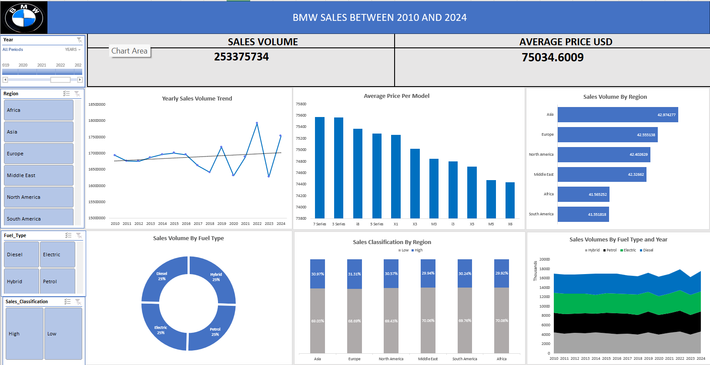

# Project 1

**Title:** BMW Global Sales Performance (2010–2024)

**Tools Used:** Microsoft Excel(Pivot Table, Pivot Chart, Slicers, KPI Cards, Timeline, Shapes&Formating, Conditional Formating)

**Project Description:** This project involved analysing BMW global sales data from 2010 to 2024 to identify trends in sales volume, pricing and performance across models, regions and fuel types. It is designed to provide a clear and interactive overview of key performance metrics. This dashboard allows stakeholders to easily monitor and assess BMW’s market performance across different years, regions, and product segments.

The dashboard includes the following features:

**Yearly Sales Volume Trend**

A visual line chart showing how BMW’s worldwide sales volume has changed from 2010 to 2024. This helps identify overall growth patterns, seasonal fluctuations and long term trends.

**Average Price per Model**

Highlights the average selling price of major BMW models. This provides insight into pricing differences across the product lineup.

**Sales Volume by Region**

Visual representation of total sales distributed across six continents, highlighting regional market share and performance.

**Sales Volume by Fuel Type**

Yearly comparison of Hybrid, Petrol, Electric, and Diesel vehicle sales, tracking the evolution of consumer preferences.

**Sales Classification by Region**

Percentage distribution of Low vs. High sales categories across geographic markets, assessing sales quality by region.

**Sales Volume by Fuel Type and Year**

Highlights how each fuel category has performed over time, revealing shifts in demand.

Additionally, the dashboard includes interactive filters and Timeline for:

**Timeline (Year):** Analyze trends and performance over specific years 

**Sales Classification:** Filter data by High or Low sales categories

**Region:** Focus on performance in specific continents or markets

**Fuel Type:** Compare sales across powertrain categorie

**Key findings:**
**Regional Sales Performance:** Identified Asia as the top-performing market while revealing remarkably balanced global sales distribution across all six continents.

**Fuel Type Evolution:** Showed Hybrid vehicles establishing consistent market leadership post-2020, with all fuel types remaining highly competitive in a transitional market.

**Pricing Strategy Consistency:** Revealed remarkably tight pricing bands across BMW's entire model portfolio, demonstrating standardized premium positioning without clear entry-level or flagship price tiers.

**Sales Classification Patterns:** Highlighted Europe's slight advantage in High-value sales mix while showing consistent 70/30 Low-to-High sales ratios globally.

**Temporal Sales Trends:** Identified 2022 as the peak sales year followed by 2023 market correction, while showing overall market stability across the 15-year period.

**Market Diversification Strength:** Demonstrated well-distributed global footprint with no single region dominating sales, reducing market-specific risk.

This dashboard serves as a crucial tool for BMW's global management team, providing clear, actionable insights that drive informed decision-making for regional strategy, product development, and market positioning.

**Dashboard Overview:**

